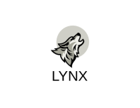

<p align="center">
  <a href="https://rabin999.github.io/lynx/"
  onClick="ga('send', 'event', 'Button', 'Click', 'Logo');">
    
  </a>
</p>


# Introduction
<p>
A Node.js architecture for building efficient, scalable, and enterprise-grade server-side applications on top of TypeScript & JavaScript (ES6, ES7, ES8)
 based on HTTP2 protocol.</p>

## Getting Started

To get started with Lynx, use Git to clone project:

```
git clone https://github.com/rabin999/lynx
npm install
npm run dev
```
> Application is running under [Localhost:8000](https://localhost:8000)

## Dependencies
 <li><a href="https://www.typescriptlang.org/index.html" target="_blank">TypeScript</a></li>
 <li><a href="https://www.fastify.io/docs/latest/Getting-Started/" target="_blank">Fastify</a></li>
 <li><a href="https://k6.io/open-source" target="_blank">K6 (Load Testing)</a></li>

## Configuration

Configuration files are located in `app/config`. Each environment and it's files are isolated for readability purpose. To change environment you can change 
`APP_ENVIRONMENT` key in `package.json` file. Now you can import config and start.

> Note, you can remove any environment file if you want. Currently it doesn't support dynamic import and export.

### Import and export files arround application

simply you can import and export as you do on normall NodeJS applicatino
```ts
import something from '../src/config.ts';
export const database = {
    database: {
        host: '203.15.188.96',
        port: something.port
    }
}
```
> you can get detail of configuration structure from [Configuration Structure](/structure?id=configuration-files)

# Usage

## Basic

To add new component, you can create new folder inside components folder indentical to `dashboard`

```
├── controller
│   └── dashboard.controller.ts
├── dashboard.ts
├── dto
├── expection
│   └── DashboardNotFoundException.ts
├── interface
├── middleware
│   └── dashboard.request.ts
├── model
│   └── dashboard.model.ts
├── route
│   └── api.routes.ts
└── util

```

Within a component, you can add require files describe as above structure. Detail about component files are describe [here](/structure?id=component-files)

## Add new routes
Create new route file inside route folder. You could use multiple prefix but need to clear for others as well. eg: `components/dashboard/route/api.routes.ts`

```ts
import DashboardController from "../controller/dashboard.controller"
import HttpException from "../../../global/exception/HttpException"
import { LynxRequest, LynxResponse } from "../../../global/service/route/types"

function routes(fastify: any, opts: any, done: any) {
    // below route is attached with middleware
    fastify.get("/", {
        onRequest: function (request: LynxRequest, reply: LynxResponse, done: any) {
            const authorized = true
            if (authorized) {
                request.log.info("This hook will always be executed after the shared `onRequest` hooks")
                done()
            } else {
                const errs = new HttpException({
                    title: "NOT_FOUND",
                    statusCode: 422,
                    description: "User is not authorized"
                })
                reply.code(422).send(errs.parse())
            }
        }
    }, new DashboardController().index)

    // simple route structure
    fastify.post("/create", new DashboardController().create)
    fastify.delete("/:id/delete", new DashboardController().delete)

    done()
}

export default routes

```

Above route will be automatically registerd by v1 routes located inside `global/route/v1.ts` which is imported by `app.ts` file at root level. 
Application also support application, component level route prefix.


# Issues and Contribution

Just submit an issue or pull request through GitHub. Thanks!

## Connect with Me

- Email: rabin@fusemachines.com
- GitHub: https://github.com/rabin999/lynx


# License
Lynx is open-sourced software licensed under the [MIT license](http://opensource.org/licenses/MIT)

